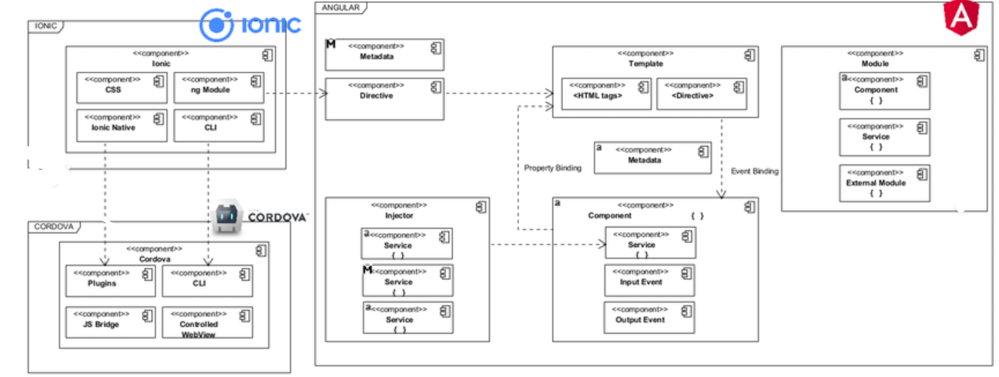

# E-shop-Frontend

 


## The architecture of our Full Stack project

We used NodeJs, MongoDb for our [Backend](https://github.com/Rafii-Ayoub/E-shop-Backend). And for the Frontend we used AngularJs and the framework Ionic.


## Getting Setup

> _tip_: this frontend is designed to work with [NodeJS-based Backend](https://github.com/Rafii-Ayoub/E-shop-Backend). It is recommended to stand up the backend first, to test it using Postman, and then the frontend should integrate smoothly.


#### Installing Node and NPM

This project depends on Nodejs and Node Package Manager (NPM). Before continuing, you must download and install Node (the download includes NPM) from [https://nodejs.com/en/download](https://nodejs.org/en/download/).

#### Installing Ionic Cli

The Ionic Command Line Interface is required to serve and build the frontend. Instructions for installing the CLI  is in the [Ionic Framework Docs](https://ionicframework.com/docs/installation/cli).

#### Installing project dependencies

This project uses NPM to manage software dependencies. NPM Relies on the package.json file located in the `frontend` directory of this repository. After cloning, open your terminal and run:

```terminal
npm install
```

## Required Tasks


#### Install Ionic

```
 npm install -g ionic
```
#### Start a new project

```
 ionic start blank
```
#### Run the project (as shown on browser)

```
ionic serve
```
#### Run the project as a mobile app

```
ionic lab
```
## Built principally With

* [typeScript](https://www.typescriptlang.org/) - A strongly typed programming language that builds on JavaScript
* [Angular](https://angular.io/) - A TypeScript-based free and open-source web application framework 
* [Ionic](https://ionicframework.com/) - A complete open-source SDK for hybrid mobile app development.

## Architecture of an Angular Ionic project


#### Angular - Ionic 


To start coding we should understand the mecanism of angular and ionic.

#### Angular Framework


#### File Directory Structure


